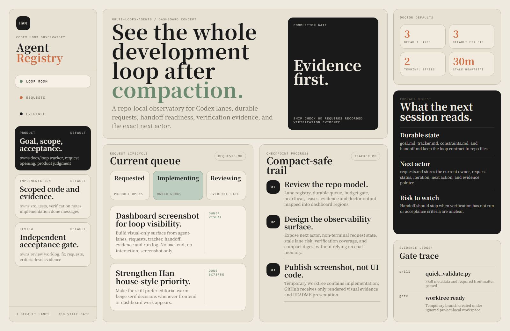

<p align="center">
  <strong>Han Design Skill v1</strong>
</p>

<p align="center">
  Han-first editorial social cards, README visuals, and warm-beige serif dashboard mockups.
</p>

<p align="center">
  
  
  
  
</p>

<p align="center">
  <a href="#quick-start">Quick Start</a>
  |
  <a href="#dashboard-preview">Dashboard Preview</a>
  |
  <a href="#usage">Usage</a>
  |
  <a href="#source-lineage">Source Lineage</a>
  |
  <a href="#license">License</a>
  |
  Social: -
</p>



`han-design-skill-v1` is a personal Codex skill for creating Han-first editorial social card systems, Rednote/Xiaohongshu carousel images, WeChat Official Account cover pairs, README visuals, dashboard mockups, and warm-beige serif editorial UI visuals.

The skill is adapted from the user's optimized copy of [`op7418/guizang-social-card-skill`](https://github.com/op7418/guizang-social-card-skill) and uses the Guizang-inspired editorial / Swiss visual system as its source lineage. The broader visual language also references [`op7418/guizang-ppt-skill`](https://github.com/op7418/guizang-ppt-skill). This repository adds the Han warm-beige serif house style, refined social-card workflow rules, templates, references, and validation tooling.

## Quick Start

Clone this repository, then copy the repo folder into your personal Codex skills directory:

```powershell
git clone https://github.com/hanco1/han-design-skill-v1.git
Copy-Item -Recurse -Force '.\han-design-skill-v1' "$env:USERPROFILE\.codex\skills\han-design-skill-v1"
```

Install dependencies and validate:

```powershell
cd "$env:USERPROFILE\.codex\skills\han-design-skill-v1"
npm install
$env:PYTHONUTF8 = '1'
python "$env:USERPROFILE\.codex\skills\.system\skill-creator\scripts\quick_validate.py" .
```

Expected validation output:

```text
Skill is valid!
```

Open a new Codex session after installation so the skill list can be rediscovered.

## Dashboard Preview

The dashboard image above is rendered visual evidence for an agent-loop observability concept. It uses only verified project facts from `multi-loops-agents`, including the default Product / Implementation / Review lanes, the default `max_fix_cycles: 3`, terminal request states `ACCEPTED` and `BLOCKED`, the default 30 minute stale-heartbeat threshold, durable state files, request ownership, and the `SHIP_CHECK_OK` completion gate.

Only PNG evidence is committed here. The temporary HTML/CSS prototype used to render the screenshot stays in an ignored local worktree and is not uploaded.

## Usage

Example social-card prompt:

```text
Use $han-design-skill-v1 with Han's warm-beige serif house style to turn this article into a 3:4 social card image set and a paired WeChat 21:9 + 1:1 cover.
```

Example frontend / README visual prompt:

```text
Use $han-design-skill-v1. Treat Han's warm-beige serif house style as the primary design authority and design a frontend dashboard mockup for this repo.
```

## What It Produces

- Rednote/Xiaohongshu 3:4 social card sets.
- WeChat Official Account `21:9` + `1:1` cover pairs.
- Article covers, product-note cards, tutorial cards, and screenshot-heavy editorial posts.
- Han-style warm-beige serif visuals for frontend/editorial design prompts.
- Editorial dashboard and README presentation visuals where Han's house style should override generic SaaS dashboard defaults.

## Skill Structure

```text
han-design-skill-v1/
|-- SKILL.md
|-- agents/
|-- assets/
|   |-- agent-loop-dashboard-preview.png
|   |-- agent-loop-dashboard-readme-hero.png
|   |-- template-editorial-card.html
|   |-- template-swiss-card.html
|   |-- magazine-bg-webgl.js
|   `-- screenshot-backgrounds/
|-- references/
|-- validate-social-deck.mjs
|-- package.json
|-- package-lock.json
|-- LICENSE
|-- NOTICE.md
`-- README.md
```

## Source Lineage

This repository is a modified personal skill derived from the user's optimized copy of [`op7418/guizang-social-card-skill`](https://github.com/op7418/guizang-social-card-skill). Its design language is inspired by the Guizang PPT style system and the original Guizang social-card workflow, then adapted into Han's own warm-beige serif house style and publication workflow.

Source references:

- Guizang Social Card Skill: [`op7418/guizang-social-card-skill`](https://github.com/op7418/guizang-social-card-skill)
- Guizang PPT Skill: [`op7418/guizang-ppt-skill`](https://github.com/op7418/guizang-ppt-skill)

See `NOTICE.md` for attribution details.

## License

This project preserves the upstream AGPL license and is distributed under `AGPL-3.0-or-later`. See `LICENSE`.
